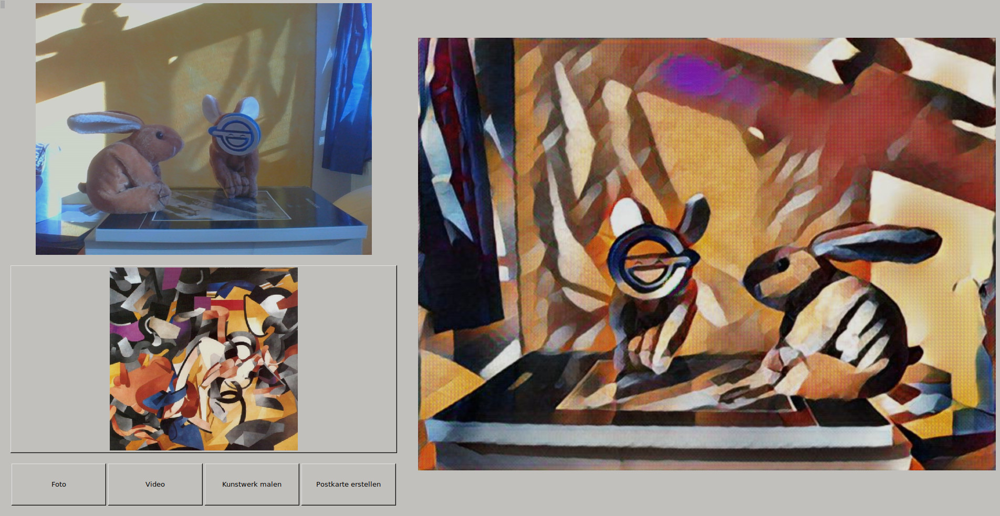

# Features

- Take a snapshot or a short video and redraw it in the style of a famous painting
- Choose your style among 11 iconic artworks
- Create postcards with your redrawn pictures


# wxArt

wxArt implements the neural art method presented in the [A Neural Algorithm of Artistic Style](https://arxiv.org/pdf/1508.06576.pdf) paper by Leon A. Gatys, Alexander S. Ecker, and Matthias Bethge.

It decomposes an image into two different representations, its style and content, and is also able to recombine those two to a new picture quite similar to the original one. But one does not have to join the two representations of one and the same image. It's also possible to recombine the style of one picture with the content of another. And this is where the fun begins.

We took 11 iconic paintings and extracted their style information. With the help of the wxArt app the user can take/load a picture using e.g. her webcam and the app will get its content and recombine it with the style of her choice.

wxArt is a wxpython interface to control a deep-art server.

We humbly wrap the wonderful code from yusuketomoto (MIT licensed):

https://github.com/yusuketomoto/chainer-fast-neuralstyle

and use the great models given by gafr:

https://github.com/gafr/chainer-fast-neuralstyle-models

# Installation

To run this application you have to install the following Python packages via your operation system's repository (recommended)

```{bash}
# In Ubuntu 16
sudo apt update
sudo apt install wxPython python-opencv python-skimage
sudo pip install chainer
```

or *pip*

```{bash}
# In Ubuntu 16
sudo pip install chainer wxPython opencv-python scikit-image
```

In order to compile postcards containing the transformed image with LaTeX, be sure to have the following packages installed.

```{bash}
# In Ubuntu 16
sudo apt install texlive-lang-german pdftk libimage-exiftool-perl
```


# Running the application

To run the application, just type the following command in your terminal

```{bash}
python main.py
```

If you want to be able to send the transformed pictures by mail, start the script using the `--email`` flag.

```{bash}
python main.py --email
```

# Troubleshooting

You are not able to capture any images with your webcam? See this little [guide](/resources/capturing/README.md) to resolve your problem.


# Further dependencies

* openCV
* [PDFtk](https://www.pdflabs.com/tools/pdftk-the-pdf-toolkit/)
* Latex, e.g [MikTex](http://miktex.org/) under Windows

